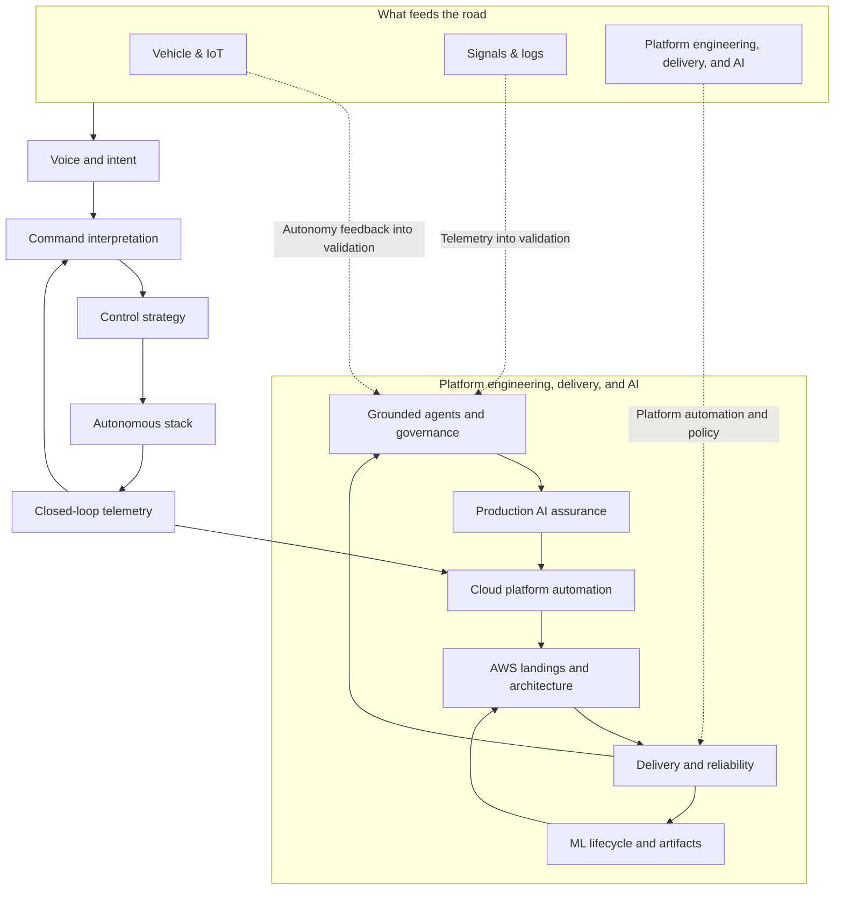
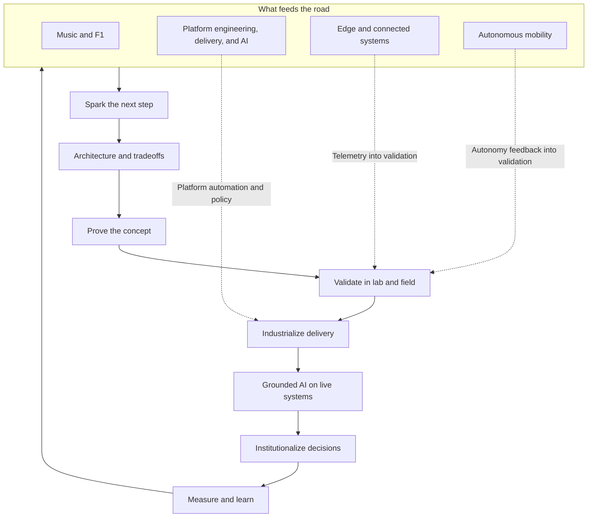
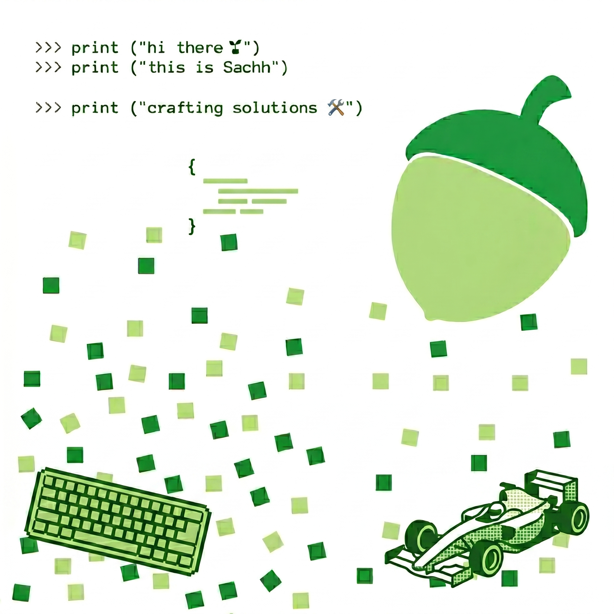

  

<h2 align="center">Following the Yellow Brick Road, Building simple paths through cloud, AI, IoT, and autonomous systems.</h2>

  

---

## Profile Trophies

  

---

## Certifications

  
  
  
  
  
  
  
  

---

## Tech Orbit

  

---

## Mission Control

<table width="100%">
  <tr>
    <td align="center" valign="top" width="33%">
      <h3>Current Build</h3>
      
      
Building a voice-controlled automation system with robotics, feedback loops, and real-world experiments.

    </td>
    <td align="center" valign="top" width="33%">
      <h3>Platform engineering, delivery, and AI</h3>
      
      
Owning reliability, automation, and grounded intelligent systems from architecture through production.

    </td>
    <td align="center" valign="top" width="33%">
      <h3>Learning Track</h3>
      
      
Exploring streaming, Android Things, device communication, and data-driven control systems.

    </td>
  </tr>
  <tr>
    <td align="center" valign="top" width="33%">
      <h3>Build Mode</h3>
      
    </td>
    <td align="center" valign="top" width="33%">
      <h3>Code Energy</h3>
      
    </td>
    <td align="center" valign="top" width="33%">
      <h3>Mindset</h3>
      
    </td>
  </tr>
</table>

---

## Engineering Cockpit: Home lab experiments

<table width="100%">
  <tr>
    <td align="center" valign="top" width="33%">
      <h3>Cloud Engine</h3>
      
      
Home lab experiments on AI systems and AI agent security: safe tool use, trust boundaries, and hardening autonomous workflows before they touch production.

    </td>
    <td align="center" valign="top" width="33%">
      <h3>Autonomy Core</h3>
      
      
Voice control, car automation, OpenCV, and IoT experiments.

    </td>
    <td align="center" valign="top" width="33%">
      <h3>Race Mode</h3>
      
      
Fast learning, technical curiosity, and motorsports obsession.

    </td>
  </tr>
</table>

---

## Currently Building

---

## Idea Flow

---

## Tech Stack

### Advanced Cloud & Platform Architecture

  
  
  
  
  
  
  
  
  
  
  
  
  
  
  
  

### Kubernetes, Platform Runtime & GitOps

  
  
  
  
  
  
  
  
  
  

### Infrastructure Engineering & Policy

  
  
  
  
  
  
  
  

### Observability, Security & Supply Chain

  
  
  
  
  
  
  
  
  
  

### Systems, Backend & Runtime Languages

  
  
  
  
  
  
  

### Advanced AI, ML & Agentic Systems

  
  
  
  
  
  
  
  
  
  

  
  
  
  
  
  
  
  
  
  
  
  
  
  

### Robotics, Autonomy & Edge Intelligence

  
  
  
  
  
  
  
  
  

### Streaming, Data Platforms & Analytics Engineering

  
  
  
  
  
  
  
  
  
  
  
  

### Distributed Systems, APIs & Integration

  
  
  
  
  
  
  
  
  

### Reliability Engineering, Verification & Release Strategy

  
  
  
  
  
  
  
  

### Engineering Productivity & Internal Platforms

  
  
  
  
  
  

---

## Joke of the day (cowsay!!)

  

---

## Connect With Me

<strong>Built with curiosity, automation, and race-day energy</strong>

  
  
  
  
  

  

<!-- 

  

 -->

---

  

